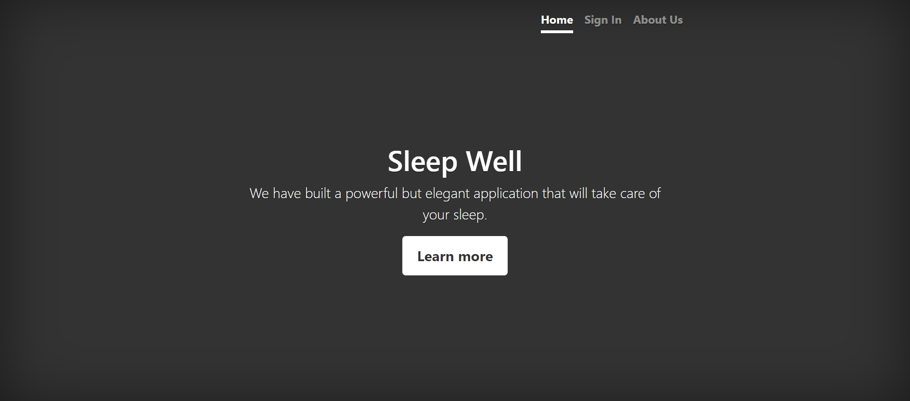
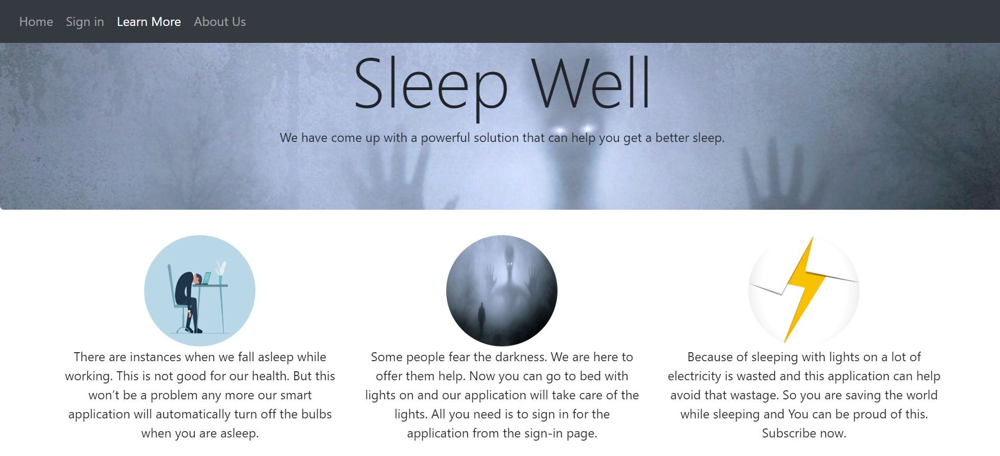
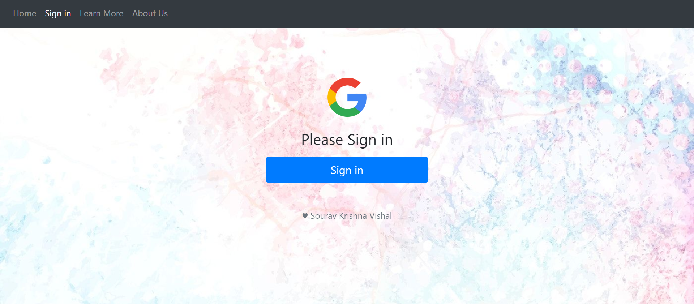
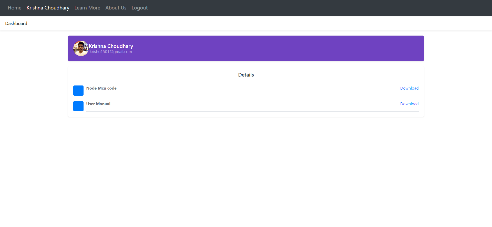
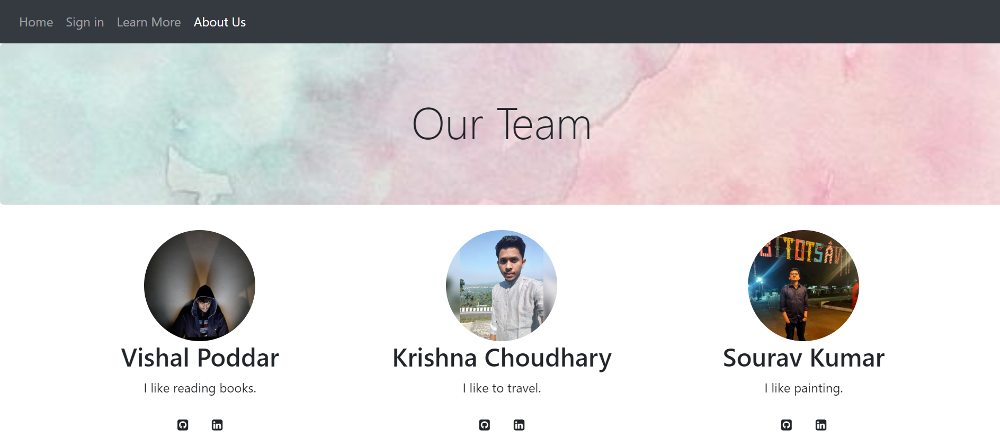

# Bettersleep

Sleep like never before with Bettersleep, the innovative web application that revolutionizes your sleep experience. Harnessing the power of IoT technology, Bettersleep automatically shuts off your room lights when you drift into dreamland, ensuring a blissful and uninterrupted night's rest.

## Table of Contents

- [Introduction](#introduction)
- [Features](#features)
- [Getting Started](#getting-started)
  - [Prerequisites](#prerequisites)
  - [Installation](#installation)
- [Usage](#usage)
- [Documentation](#documentation)
- [Technologies](#technologies)
- [Contributing](#contributing)
- [Website at a glance](#website-at-a-glance)

## Introduction

Bettersleep is designed to address the common issue of forgetting to switch off room lights before falling asleep. With the help of IoT integration, this web application ensures that your lights are automatically turned off when you drift into sleep. By offering a convenient and effortless solution, Bettersleep enhances your sleep routine, promotes energy conservation, and contributes to a more sustainable lifestyle.

## Features

- **Automatic Light Switching**: Bettersleep utilizes IoT technology to automatically switch off your room lights when you fall asleep.
- **User-friendly Interface**: The web application provides a simple and intuitive interface for users to start using the service.
- **Energy Conservation**: By turning off lights when not needed, Bettersleep promotes energy efficiency and reduces unnecessary power consumption.
- **Integration with IoT Devices**: The application seamlessly integrates with compatible IoT devices, ensuring a smooth and reliable user experience.

## Getting Started

Follow these instructions to get a copy of the Bettersleep project up and running on your local machine for development and testing purposes.

### Prerequisites

- Python (version 3.7 or higher)
- Flask (installation instructions provided in the next section)

### Installation

1. Clone the repository:

   ```bash
   git clone https://github.com/krishu1501/bettersleep.git
   ```

2. Change to the project directory:

   ```bash
   cd bettersleep
   ```

3. Install the required Python packages using pip:

   ```bash
   pip install -r requirements.txt
   ```

 4. Change the following line in file main\app.py  
   `app.config.from_object(config['prod'])`  
   to  
   `app.config.from_object(config['dev'])`

5. create local SQLite database using commands present in file main\create_db.py:
   ```bash
   python -m main.create_db
   ```
 
 6. Create a project in [Google cloud console](https://console.cloud.google.com/) and get credentials to accept google login from users.  
Then set the following environment variables in local.  
`CLIENT_ID`, `CLIENT_SECRET`, `REDIRECT_URI`  

You can skip steps 5 and 6 above if you just want to browse the website without the Google login function. 

## Usage

1. Start the Flask development server:

   ```bash
   flask run
   ```

2. Open your web browser and visit `http://localhost:5000` to access the Bettersleep web application.

3. Follow the on-screen instructions to login and authorize the application to access your real-time sleep data to be used by your IoT device.

## Documentation

For detailed information on how to use Bettersleep and its features, please refer to the [User Manual](main/uploads/user_manual.pdf).

## Technologies

- **Authorization**: *OAuth 2.0*
- **Backend**: *Python, Flask*
- **Frontend**: *Bootstrap library*
- **Deployment**: *IBM Cloud*

## Contributing

Contributions to Bettersleep are welcome! If you encounter any issues or have suggestions for improvements, please submit a GitHub issue.

## Website at a glance:  

Homepage



Learn more



Login



User Dashboard




About us



